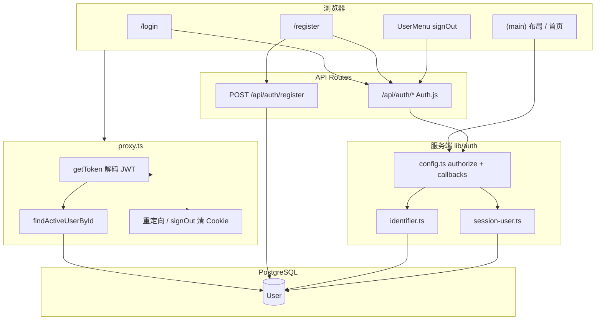

# 用户中心：认证模块技术文档

本文档描述「用户中心」需求中**登录 / 注册 / 安全退出**相关能力的技术选型、模块划分与核心设计，对应当前 `feat/auth` 分支已实现内容。

## 需求对照

| 需求项 | 实现状态 | 说明 |
|--------|----------|------|
| 手机号 / 邮箱等方式登录 | ✅ | 登录页使用统一 `identifier` 字段，服务端解析为邮箱或手机号后查库 |
| 手机号 / 邮箱等方式注册 | ✅ | 注册时邮箱、手机号至少填一项，可同时填写；密码仅存哈希 |
| 安全退出登录 | ✅ | 顶栏用户菜单调用 Auth.js `signOut`，清理会话 Cookie 并跳转登录页 |

本阶段**不包含**：短信验证码、OAuth、忘记密码、邮箱验证、用户资料编辑页等，可在后续分支扩展。

---

## 关键技术选型

### Next.js App Router + `proxy.ts` 路由守卫

项目基于 **Next.js 16**，页面路由采用 App Router。未登录访问主应用区时，由根目录 **`proxy.ts`**（Next.js 16 对 Middleware 的演进命名）在请求进入页面前完成鉴权与重定向，避免未授权用户看到受保护布局。

选择在该层只做 **JWT 解码 + 轻量用户存在性校验**（见下文 `session-user`），而不在 proxy 内直接挂载完整 Prisma 查询栈，以降低边缘运行时复杂度；完整会话信息在服务端组件中通过 `auth()` 获取。

### Auth.js v5（`next-auth@5`）+ Credentials Provider

| 方案 | 选型 | 理由 |
|------|------|------|
| 认证框架 | Auth.js v5 (`next-auth@5.0.0-beta.31`) | 与 App Router 集成成熟，内置 CSRF、Cookie、signIn/signOut 端点 |
| 登录方式 | Credentials（邮箱/手机号 + 密码） | 符合当前自建账号体系，无需第三方 IdP |
| 会话策略 | **JWT**（`session.strategy: "jwt"`） | 不依赖 `@auth/prisma-adapter` 与 `Session` 表，与 Credentials 组合简单 |
| 密码哈希 | `bcryptjs`，cost **12** | 成熟默认方案，注册与校验均在服务端完成 |

未引入 Prisma Adapter 的原因：当前无 OAuth、无数据库 Session 表；JWT 即可满足「无状态 Cookie 会话 + 服务端 `auth()` 读 session」的需求。后续若接入 GitHub / Google，可再扩展 `Account` 等模型并评估 Adapter。

### Prisma + PostgreSQL

用户账号持久化在 **`User`** 表：`email`、`phone` 均为可选但各自 **唯一**，支持「仅邮箱」「仅手机」「邮箱+手机」三种注册形态。业务实体（`Post`、`Draft`、`Prompt`）通过 `userId` 关联，便于后续按登录用户隔离数据。

### Zod 校验

登录、注册的**最终校验**在服务端通过 **Zod** 完成（`lib/auth/schemas.ts`），客户端表单仅做体验层校验。避免绕过前端直接构造非法请求。

### 客户端 / 服务端模块拆分

| 导入路径 | 运行环境 | 内容 |
|----------|----------|------|
| `@/lib/auth` | 服务端 only | `auth`、`getCurrentUser`、schemas、Prisma 相关逻辑 |
| `@/lib/auth/client` | 客户端 | 仅 `safe-callback-url` 等无 Node 依赖工具 |
| `@/lib/auth/safe-callback-url` | 同构 | 登录回跳 URL 白名单（登录页 Client 使用） |

`lib/auth/config.ts`、`lib/db/*` 等文件标注 **`import "server-only"`**，防止 Client Component 误导入导致打包解析 `dns` 等 Node 内置模块失败。

---

## 总体架构



**请求路径摘要：**

1. **注册**：`POST /api/auth/register` 写库 → 同页 `signIn("credentials")` 建立会话 → 跳转首页。
2. **登录**：`signIn("credentials")` → `authorize()` 校验 → JWT 写入 Cookie。
3. **访问受保护页**：`proxy` 校验 token 与用户是否存在 → 否则带安全 `callbackUrl` 跳转 `/login`。
4. **读当前用户**：服务端 `getCurrentUser()` → `auth()` → `session` callback 回查 DB。
5. **退出**：`signOut({ callbackUrl: "/login", redirect: true })` → Auth.js 清除会话 → 跳转登录页。

---

## 目录与职责

```text
app/
  (auth)/
    login/page.tsx          # 登录 UI，identifier + password
    register/page.tsx       # 注册 UI，邮箱/手机 + 自动登录
  (main)/
    layout.tsx              # 服务端二次鉴权 + DashboardShell
    page.tsx                # 登录后首页
  api/auth/
    [...nextauth]/route.ts  # Auth.js handler（runtime: nodejs）
    register/route.ts       # 注册 API

components/
  layout/user-menu.tsx      # 头像菜单 + 安全退出
  providers/session-provider.tsx  # SessionProvider，供 signOut 等客户端 API

lib/auth/
  config.ts                 # NextAuth 配置、authorize、jwt/session callbacks
  session.ts                # getCurrentUser()
  session-user.ts           # 按 id 回查活跃用户（proxy + session 共用）
  identifier.ts             # 解析 identifier → 邮箱 | 手机，并查库
  validators.ts             # 邮箱/手机号格式（含 dev @localhost）
  schemas.ts                # Zod：credentialsSchema、registerSchema
  safe-callback-url.ts      # callbackUrl 同站白名单
  client.ts                 # 客户端安全导出
  index.ts                  # 服务端 barrel

lib/db/
  prisma.ts                 # Prisma Client（server-only）
  redis.ts                  # Redis（预留，认证主路径未依赖）

proxy.ts                    # 路由守卫
types/next-auth.d.ts        # Session / JWT 类型扩展
prisma/schema.prisma        # User 模型
prisma/seed.ts              # 开发管理员账号
```

---

## 数据模型

```prisma
model User {
  id           String   @id @default(cuid())
  email        String?  @unique
  phone        String?  @unique
  passwordHash String?
  name         String?
  image        String?
  role         Role     @default(USER)
  // ... 业务关联 posts / drafts / prompts
}
```

设计要点：

- **`email` / `phone` 均可空且唯一**：注册时至少提供其一；登录时用 `identifier` 统一入口解析。
- **`passwordHash` 可空**：为将来纯 OAuth 用户预留；当前密码用户注册时必写哈希。
- **`role`**：`USER` | `ADMIN`，写入 JWT，并在 session 回查时同步到前端（如管理员标识）。

---

## 核心模块设计

### 1. 统一登录标识（`identifier`）

`lib/auth/identifier.ts` 将用户输入解析为两类之一：

| 输入特征 | 类型 | 处理 |
|----------|------|------|
| 含 `@` | 邮箱 | 转小写，`isValidAuthEmail`（标准邮箱 + 开发环境 `*@localhost`） |
| 否则 | 手机号 | `normalizePhone`（去非数字、去 `86` 前缀）后校验大陆 11 位 `1[3-9]…` |

`authorize()` 与 `findUserByIdentifier()` 按类型分别 `findUnique({ where: { email } })` 或 `{ phone }`。

### 2. 注册 API

`POST /api/auth/register`：

1. `registerSchema` 校验：`name`、密码长度、**email 与 phone 至少一项**。
2. 分别检查邮箱 / 手机是否已占用（`409`）。
3. `bcrypt.hash(password, 12)` 后 `prisma.user.create`。
4. 响应仅返回安全字段（不含 `passwordHash`）。

注册页在成功后使用同一 `identifier`（优先邮箱，否则手机号）调用 `signIn("credentials")`，避免用户二次输入。

### 3. JWT 会话 + 数据库回查（防「删号仍登录」）

仅把 JWT 当作「用户 ID 指针」，**不信任其长期有效表示用户仍合法**：

```ts
// jwt callback：登录瞬间写入 id、role
jwt({ token, user }) {
  if (user) {
    token.id = user.id;
    token.role = user.role;
  }
  return token;
}

// session callback：每次 auth() 读 session 时回查 DB
async session({ session, token }) {
  const dbUser = await findActiveUserById(token.id);
  if (!dbUser) {
    return { expires: new Date(0).toISOString() }; // 视为未登录
  }
  return { ...session, user: { id, email, phone, name, image, role } };
}
```

**`proxy.ts`** 同样调用 `findActiveUserById`：

- 无 token 或未登录 → 跳转 `/login?callbackUrl=…`（`callbackUrl` 经白名单处理）。
- **有 token 但用户已删除** → 先重定向 `/api/auth/signout?callbackUrl=…`，由 Auth.js 清理 Cookie，再进入登录页。

`app/(main)/layout.tsx` 中 `getCurrentUser()` 为**第二道防线**，无用户时 `redirect("/login")`，避免仅依赖客户端状态渲染主应用壳。

### 4. 安全退出登录

`components/layout/user-menu.tsx`（Client Component）：

```ts
await signOut({
  callbackUrl: "/login",
  redirect: true,
});
```

- 由 Auth.js 处理 **`/api/auth/signout`**，删除会话 Cookie。
- `redirect: true` 确保退出后落在登录页，防止仍停留在受保护路由。
- 外层 `app/(main)/layout` 需 `SessionProvider`（`components/providers/session-provider.tsx`）包裹，以便客户端调用 `signOut`。

退出为**服务端会话失效 + 浏览器 Cookie 清理**，不是仅前端清空状态。

### 5. 登录后回跳（`safe-callback-url`）

- **`getSafeCallbackPath`**：供 `proxy` 写入 `callbackUrl`，仅允许同站相对路径，拒绝 `//`、`://`、`\`、编码绕过，且禁止回跳到 `/login`、`/register`。
- **`resolveSafeCallbackUrl`**：供登录页读取 query，完整 URL 须与当前 `origin` 同源。

避免开放重定向钓鱼。

### 6. 路由守卫规则（`proxy.ts`）

| 条件 | 行为 |
|------|------|
| 未登录 + 非认证页 | → `/login?callbackUrl=<安全路径>` |
| 未登录 + token 存在但用户不存在 | → `/api/auth/signout` → 登录页 |
| 已登录 + `/login` 或 `/register` | → `/` |
| `/api/*`、静态资源 | 不拦截（matcher 排除） |

认证相关页面目前仅 **`/login`、`/register`** 对访客开放；其余页面路径默认受保护。

---

## 页面与 UI 集成（简要）

登录 / 注册为独立 `(auth)` 路由组；登录后主应用由 `(main)/layout.tsx` 挂载 **`DashboardShell`**（顶栏、侧栏、用户菜单）。用户中心相关的**展示与退出**落在 `UserMenu`；业务首页、编辑器等布局属产品壳层，细节见各 layout 组件，本文不展开 UI 规范。

---

## 环境变量

```env
DATABASE_URL=""      # PostgreSQL
AUTH_SECRET=""       # JWT/Cookie 签名（也可用 NEXTAUTH_SECRET）
AUTH_URL=""          # 应用对外 URL，须与 dev 端口一致
REDIS_URL=""         # 基础设施预留，认证主路径未依赖
```

`.env.example` 中保留 `NEXTAUTH_*` 兼容旧命名；代码优先读取 `AUTH_SECRET`。

---

## 安全设计摘要

| 项 | 做法 |
|----|------|
| 密码存储 | 仅 `passwordHash`，bcrypt cost 12 |
| 登录失败 | `authorize` 返回 `null`，统一错误文案，降低账号枚举 |
| 注册响应 | 不返回 `passwordHash` |
| 会话失效 | 删用户后 session / proxy 双路径失效 |
| 回跳 URL | 同站白名单 |
| 校验位置 | 注册 API、Credentials `authorize` 均以 Zod 为准 |
| CSRF | Auth.js 内置 signIn/signOut 流程 |

待增强：接口限流、更强密码策略、验证码登录、审计日志等。

---

## 开发账号

```bash
npm run db:seed
```

| 字段 | 默认 |
|------|------|
| 邮箱 | `admin@localhost` |
| 密码 | `Admin12345` |
| 角色 | `ADMIN` |

可通过 `DEV_ADMIN_EMAIL`、`DEV_ADMIN_PASSWORD`、`DEV_ADMIN_NAME` 覆盖。seed 使用 `upsert`，可重复执行。

---

## 本地运行与验证

```bash
npm install
npm run docker:up
npm run db:generate
npm run db:push
npm run db:seed   # 可选
npm run dev
```

建议验证路径：

1. 未登录访问 `/` → 跳转 `/login`。
2. `/register`：仅手机 / 仅邮箱 / 两者兼有注册 → 自动登录 → `/`。
3. `/login`：邮箱或手机号 + 密码登录。
4. 顶栏用户菜单 **退出登录** → `/login`；再访问 `/` 应再次要求登录。
5. 已登录访问 `/login`、`/register` → 跳转 `/`。
6. （可选）删除 DB 中用户后，带旧 Cookie 访问 → 应经 signOut 清理后回到登录页。

---

## 当前边界与后续扩展

**本分支有意保持收敛：**

- 无短信 / 邮箱验证码，仅为「标识 + 密码」。
- 无 OAuth、无忘记密码、无邮箱验证流程。
- 无独立「用户中心」资料页（除顶栏菜单与占位首页壳）。
- 无基于 `role` 的细粒度路由 ACL（仅数据字段与管理员展示预留）。

**后续分支可扩展：**

- OAuth + Prisma Adapter + `Account` 表。
- 短信验证码 Provider 或二次验证。
- 用户资料、改密、注销账号。
- Redis 限流、登录审计、Session 吊销列表。

---

## 相关文件索引

| 能力 | 主要文件 |
|------|----------|
| Auth 配置与会话回调 | `lib/auth/config.ts` |
| 当前用户 | `lib/auth/session.ts` |
| 用户存在性回查 | `lib/auth/session-user.ts` |
| 标识解析 | `lib/auth/identifier.ts`、`lib/auth/validators.ts` |
| 校验 Schema | `lib/auth/schemas.ts` |
| 注册 | `app/api/auth/register/route.ts` |
| Auth 路由 | `app/api/auth/[...nextauth]/route.ts` |
| 路由守卫 | `proxy.ts` |
| 安全退出 | `components/layout/user-menu.tsx` |
| 类型扩展 | `types/next-auth.d.ts` |
